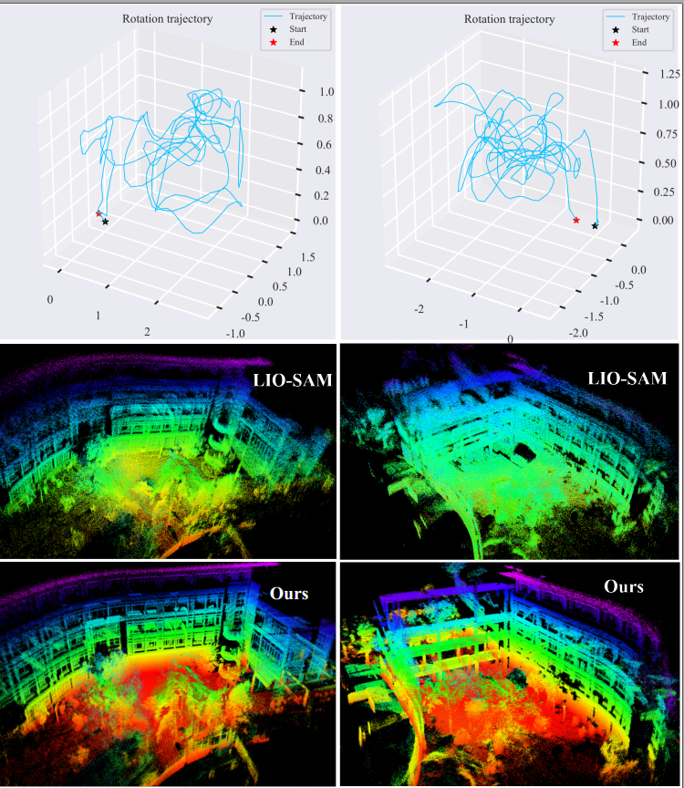
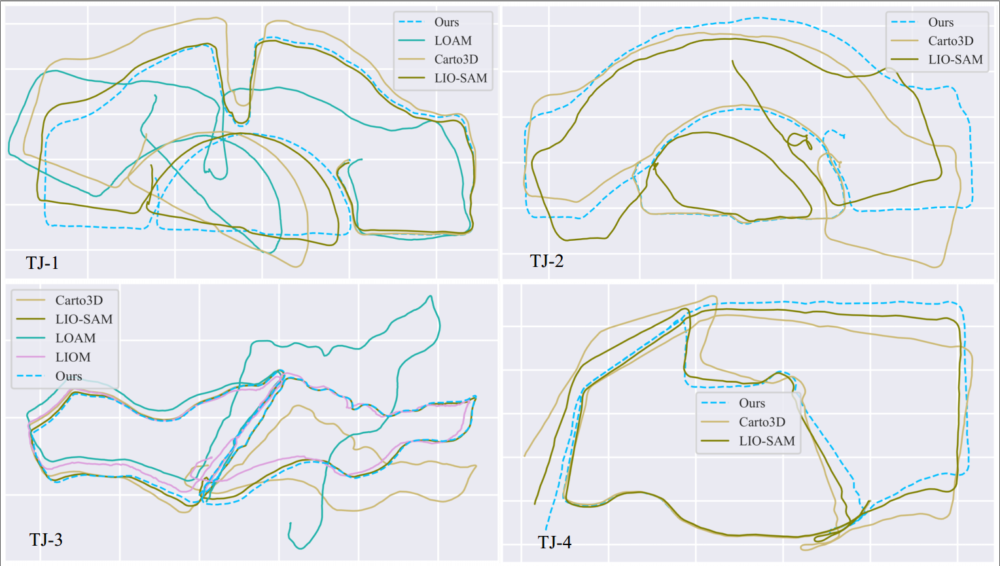

> This repository is the implementation of our paper "D-LIOM: Tightly-coupled Direct LiDAR-Inertial Odometry and Mapping" (Under Review). 

> A running demo can be found at https://youtu.be/21J2QLUQbno or at https://www.bilibili.com/video/BV14y4y157du
---
### Prerequisites
- Install depends follow the instructions of ["cartographer"](https://google-cartographer.readthedocs.io/en/latest/index.html) and ["cartographer_ros"](https://google-cartographer-ros.readthedocs.io/en/latest/compilation.html) respectively. 
- Build [OpenCV 3.3.1](https://opencv.org/releases/page/2/) (other version may work fine if it includes implementation of SURF keypoint detector) from source with "opencv_contrib"
- [GTSAM 4.0.2](https://github.com/borglab/gtsam/tree/4.0.2)
---
### Build
- Clone this repo in your ROS workspace
- Set CMake variable "OpenCV_DIR" in the root [CMakeLists.txt](src/cartographer/CMakeLists.txt) of "cartographer". 
- Return th the root folder of your ROS workspace and run:

      catkin_make_isolated
---
### Run an online demo
#### TONGJI Handheld Dataset
- Some demo sequences can be downloaded via: 
  - TONGJI handheld dataset: [link](https://pan.baidu.com/s/12Y6CErygofwPf9f8FrNLqA), pwd: hfrl
-     roslaunch dlio demo_dlio_tongji.launch bag_filename:=BAG_FILE_PATH
  where BAG_FILE_PATH is the full path of the downloaded bag file in your device

- Some results

#### NTU-VIRAL
- The dataset is available online at [NTU-VIRAL](https://ntu-aris.github.io/ntu_viral_dataset/)
-     roslaunch dlio demo_dlio_viral.launch bag_filename:=BAG_FILE_PATH
  where BAG_FILE_PATH is the full path of the downloaded bag file in your device
#### KAIST-Complex Urban Dataset
- The dataset is available online at [KAIST](https://irap.kaist.ac.kr/dataset/)
- Play KAIST bag follow the instruction: [file_player](https://irap.kaist.ac.kr/dataset/development.html)
-     roslaunch dlio demo_dlio_kaist.launch
#### Your own data
- Write a urdf file of your device and save it to folder ['urdf'](src/dlio/urdf)
- Write a configuration file of your data and save it to ['config'](src/dlio/config)
- Write a launch file of your data and save it to ['launch'](src/dlio/launch)
- Run your bag as above examples
---
### Run offline and view mapping result
#### Launch dlio offline
    roslaunch dlio dlio_offline_tongji bag_filenames:=BAG_FILE_PATH
#### View mapping result
    roslaunch dlio dlio_map_viewer_rectified urdf_filename:=tongji pose_graph_pb_filename:=PG_FILENAME range_data_pb_filename:=RD_FILENAME rate:=100
  where PG_FILENAME and RD_FILENAME are binary pbstream files saved to disk when launch the offline script above.

---
### Acknowledgements
- The authors of [cartographer](https://github.com/cartographer-project/cartographer)
- The authors of [cartographer_ros](https://github.com/cartographer-project/cartographer_ros)
- The authors of [LIO-SAM](https://github.com/TixiaoShan/LIO-SAM)
- The authors of [VINS-Mono](https://github.com/HKUST-Aerial-Robotics/VINS-Mono)

